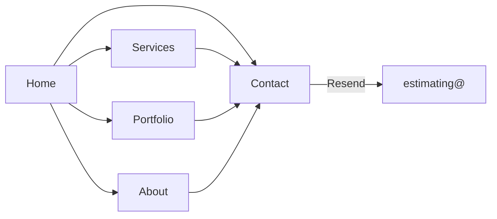

# Covenant Builders Rebuild Plan

> Overview: Rebuild covenantbuilders.org as a Next.js marketing site with a redesigned visual system, verified Florida license trust signals, Resend-powered estimate intake to estimating@, an honest portfolio scaffold, and an ops checklist for Google Workspace email cutover — while documenting live WordPress P0 issues for the cutover.

## Implementation status

| Todo | Status |
|---|---|
| Scaffold Next.js 14 + TS + Tailwind app with fonts, CSS variables, layout, and content/site.ts | Completed |
| Build header, footer, trust-band, hero, section primitives with redesign visual system + motion | Completed |
| Implement Home, Services, Portfolio, About, Contact, Privacy with rewritten truthful copy | Completed |
| Salvage usable images; honest gallery with categories, captions, alts, and more-coming state | Completed |
| Zod + Server Action + Resend lead form with honeypot, success/error UI, env config | Completed |
| Localized metadata, LocalBusiness/Organization schema, sitemap, robots, OG image | Completed |
| Write email-cutover.md, wordpress-cutover.md, and condensed audit notes | Completed |
| Responsive pass, a11y, image optimization, remove newsletter/fake socials, final content QA | Completed |

## Decisions locked

- **Stack:** Next.js 14 App Router, TypeScript, Tailwind CSS, Zod, next-safe-action patterns for the contact form
- **Leads:** Server Action → **Resend** → `estimating@covenantbuilders.org` (env-configurable fallback inbox until Workspace DNS is live)
- **Portfolio v1:** Honest structure using salvageable current-site assets + clear “more projects coming” — no invented case studies or fake testimonials
- **Public emails:** `info@`, `estimating@`, `josias@` only (no Gmail on the site)
- **Phones:** `(772) 473-7115` (Josias Sr), `(772) 473-7914` (Josias Jr)
- **Hosting target:** Vercel-ready static/SSR marketing site; cut over DNS after launch

## Audit summary (drives rebuild)

See also [audit-notes.md](./audit-notes.md).

| Priority | Issue | Rebuild response |
|---|---|---|
| P0 | Public `/wp-admin/` database-upgrade screen | Document in cutover checklist; new site replaces WP — secure/take down WP before DNS flip |
| P0 | Fake testimonials, `0+` stats, dummy `+1234-567-890` | Never ship placeholders |
| P1 | Residential/Commercial/Industrial copy swapped | Rewrite service model with truthful descriptions |
| P1 | Duplicate About bio / Home sections | Single source of content modules |
| P1 | Gmail vs footer domain email mismatch | Role-based `@covenantbuilders.org` everywhere |
| P1 | Portfolio without names/scope/alts | Honest gallery scaffold + captions |
| P1 | No license / years proof | Trust band: CBC1253676, licensed since 2005, active through 2028 |
| P2 | Weak SEO / heading hierarchy | Localized metadata + LocalBusiness schema |

## Visual direction (redesign, not template clone)

Evolve the existing navy + warm sand brand into a sharper Treasure Coast builder look — **not** purple gradients, cream/terracotta clichés, or generic construction-template cards.

- **Palette:** deep navy (`~#12182B`), warm sand accent (`~#C4A574`), stone/off-white surfaces, charcoal type — atmospheric gradients/subtle grain, not flat white slabs
- **Type:** expressive serif for brand/display (e.g. Fraunces or Similar), clean sans for UI/body (e.g. Source Sans 3) — avoid Inter/Roboto/system defaults
- **Hero:** full-bleed photography plane; brand-first; one headline, one supporting line, one CTA group — no overlays/badges/stat strips in first viewport
- **Sections:** one job each; cards only where interaction requires them (form, project tiles if needed for click targets)
- **Motion:** 2–3 intentional entrance/hover motions (hero fade/rise, section reveal, CTA underline) — presence, not noise
- **Bilingual:** keep “Hablamos español” as a real trust signal near contact/CTA; no full Spanish locale in v1

## Site information architecture



**Pages**

1. **Home** — brand hero, trust band (license/years), services preview, why us (truthful), gallery teaser, consultation CTA
2. **Services** — New Home Builds, Custom Kitchens / Cabinetry, Commercial Projects, Remodels (aligned copy; no Industrial mismatch unless they truly do industrial)
3. **Portfolio** — filterable scaffold (All / Residential / Commercial / Remodel) with available images, honest captions, empty-state honesty
4. **About** — single Josias Andujar founder story (cabinetmaker → Treasure Coast 2004 → CBC1253676), Interior Specialties Inc DBA lineage, bilingual note
5. **Contact** — estimate form + Sr/Jr phones + address (normalize to **5400 85th Ave, Vero Beach, FL 32967**) + hours + response expectation
6. **Legal stubs** — Privacy (form/newsletter consent) and minimal Terms if needed for form disclosure

## Trust content to ship (verified)

Public trust strip (header footer and About):

- Florida Certified Building Contractor **CBC1253676**
- Licensed since **December 8, 2005** (~20 years)
- Status **Active**, expires **August 31, 2028**
- License DBA historically **Interior Specialties Inc**; brand operating as **Covenant Builders**
- Link/note: verify via Florida DBPR license lookup (external)

No unverified claims: no fake review counts, awards, or project totals.

## Lead form (1A)

- Fields: name, email, phone, project address, project type (select), message
- Validation: Zod
- Server Action sends via Resend to `estimating@covenantbuilders.org`
- Env: `RESEND_API_KEY`, `LEAD_TO_EMAIL` (default estimating@), `LEAD_FROM_EMAIL` (e.g. `noreply@` or Resend onboarding domain until DNS ready)
- Honeypot + basic rate limiting / abuse guard
- Success/error UI; privacy note under form
- Until Workspace is live: set `LEAD_TO_EMAIL` to a working inbox (temporary) without putting Gmail on the page

## Email ops (included, not provisioned in code)

See [email-cutover.md](./email-cutover.md) and [wordpress-cutover.md](./wordpress-cutover.md).

## Project structure

```
app/
  layout.tsx
  page.tsx
  services/page.tsx
  portfolio/page.tsx
  about/page.tsx
  contact/page.tsx
  privacy/page.tsx
  actions/lead.ts
  globals.css
components/
  site-header.tsx
  site-footer.tsx
  trust-band.tsx
  hero.tsx
  contact-form.tsx
  project-gallery.tsx
content/
  site.ts
public/
  images/
docs/
  rebuild-plan.md
  email-cutover.md
  wordpress-cutover.md
  audit-notes.md
  launch-runbook.md
```

## Content rewrite rules

- Fix all service mismatches from Home/Services
- One About biography (edit existing founder story for punctuation/clarity; keep facts)
- Fix “qoute” → “quote”; remove stray closing quote on consultation line
- Normalize address to Ave; format phones as `(772) 473-7115`
- Drop newsletter in v1 unless a real provider is wired (avoid fake subscribe)
- Social links: only include if URLs are confirmed; otherwise omit rather than dead icons

## Launch checklist

- [ ] Env vars set on Vercel
- [ ] Test lead email delivery end-to-end
- [ ] Lighthouse pass (mobile): LCP hero image optimized (WebP), CLS stable
- [ ] Metadata + OG image per page
- [ ] Sitemap + robots.txt
- [ ] WordPress secured/retired before DNS flip
- [ ] Google Workspace mailboxes live; update `LEAD_TO_EMAIL` if needed
- [ ] Google Business Profile emails/phones match site

## Out of scope for v1

- Full Spanish locale
- CMS / Payload
- Live license API integration (static verified facts + DBPR link only)
- Invented testimonials or project counts
- Actually purchasing/configuring Google Workspace (ops doc only)

## Related docs

- [Launch runbook](./launch-runbook.md)
- [Email cutover](./email-cutover.md)
- [WordPress cutover](./wordpress-cutover.md)
- [Audit notes](./audit-notes.md)
